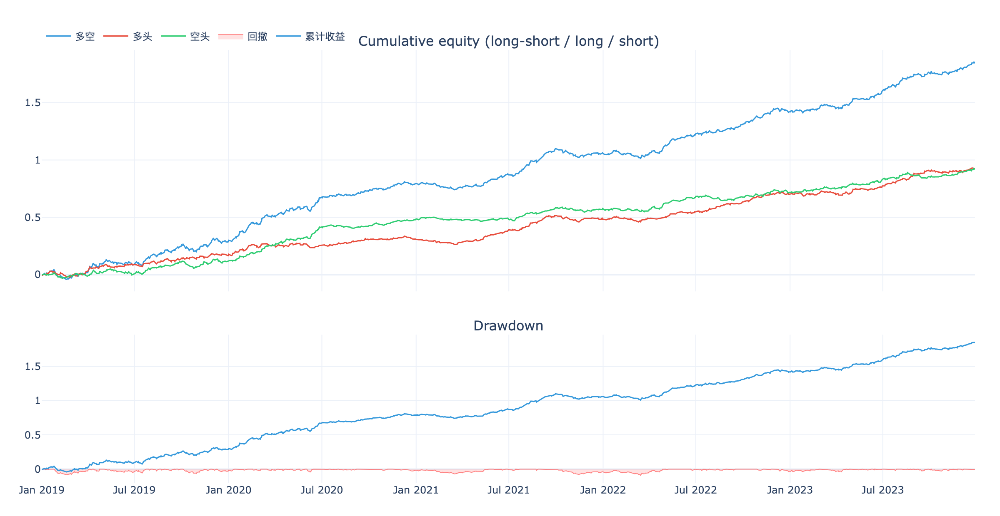
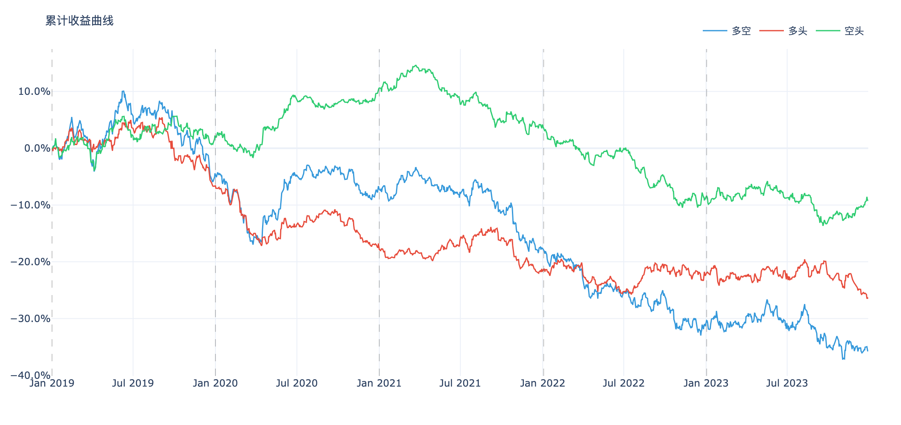
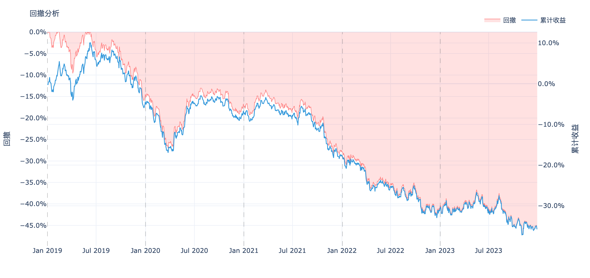
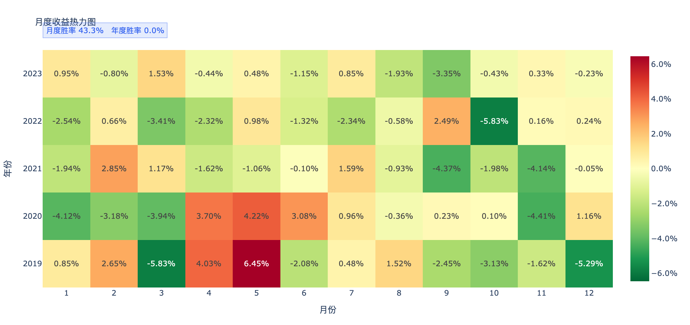
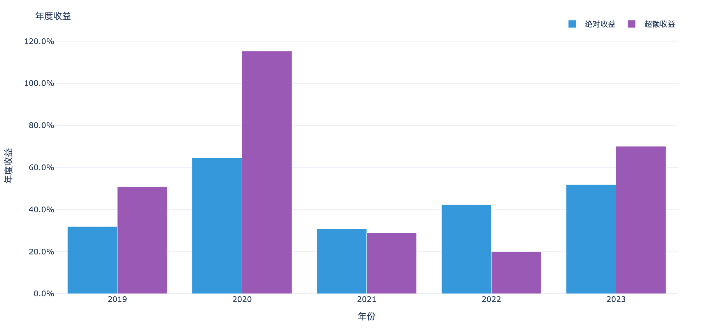
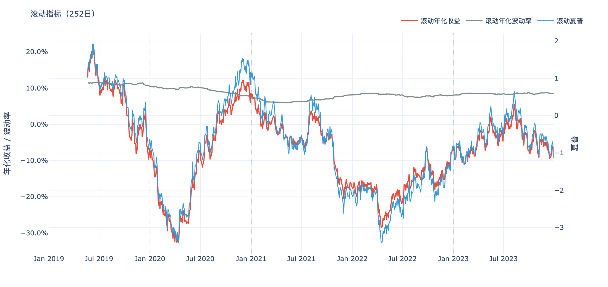
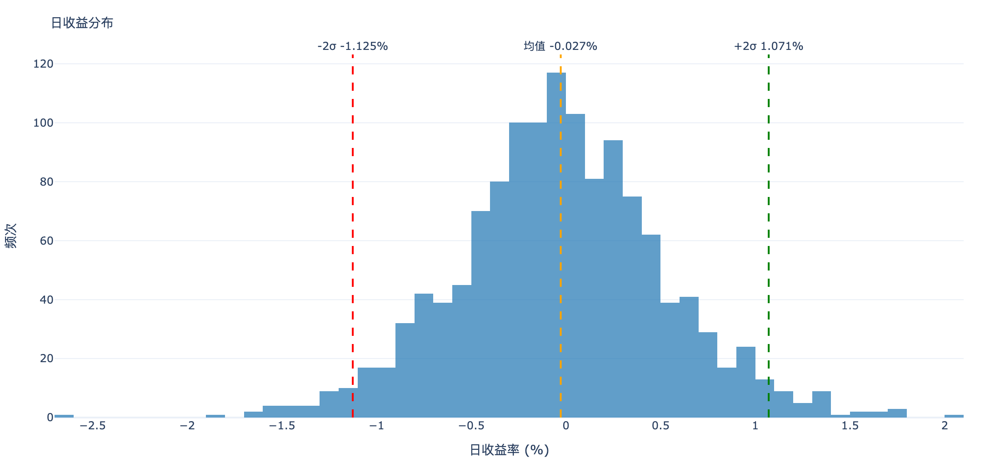
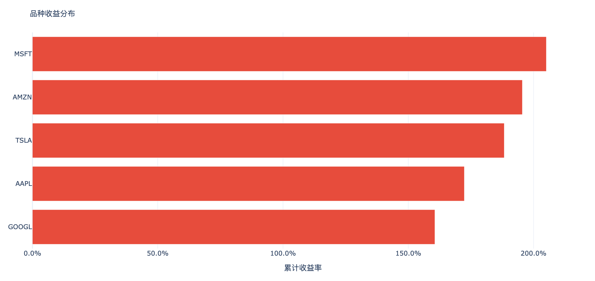
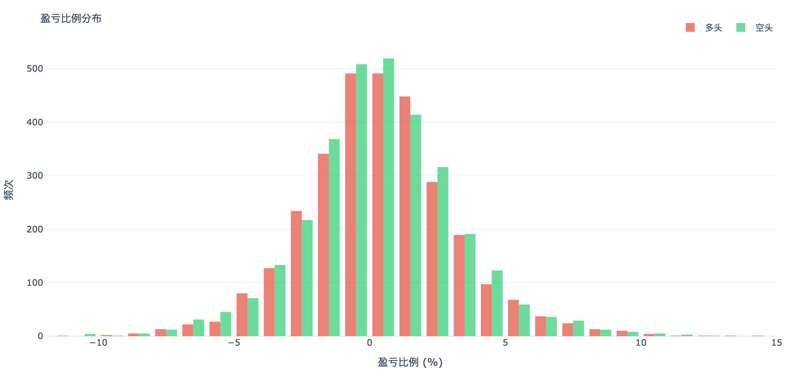
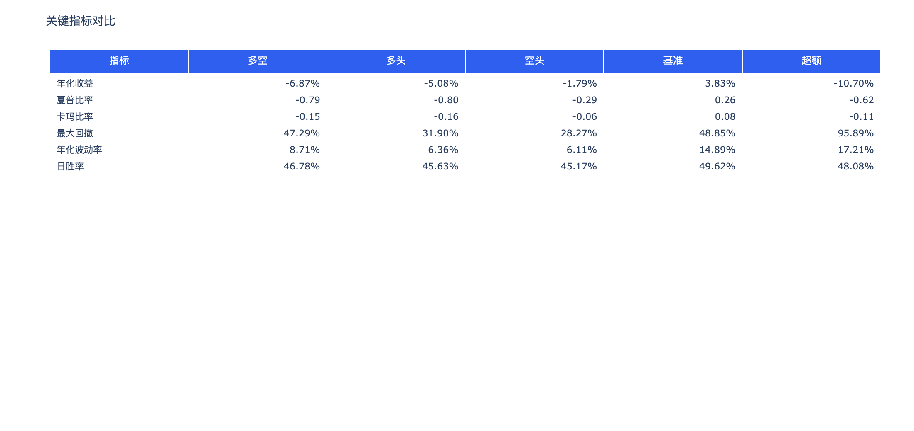

# wbt

**A position-weighted backtesting engine for quantitative strategies** — a Rust core for speed and determinism, a Python-first API for research.



> The figure above is a real report: a 5-symbol, 5-year (2019–2023) mock weight table passed through `WeightBacktest` → `wb.to_result()` → `wbt.plotting`, rendered with zero configuration. The sample is deliberately tuned to a strong profile (Sharpe ≈ 3.4, annualized ≈ 35.7%, max drawdown ≈ 9.0%) so the report is visually readable — the underlying weight signal mixes a lookahead edge with Gaussian noise purely for demo aesthetics, **not** a real strategy.

[中文说明](README.md)

## Why This Project Exists

Most strategy teams treat **target position weights** as the canonical interface between signal generation and execution simulation: the signal layer decides "what weight to hold," the backtest layer turns those weights into returns, risk, and trades. Existing tools either simulate at the order/matching-engine level (too detailed, too slow) or are pure-Python loops that don't scale to large multi-symbol weight tables.

wbt is built on one **unified backtesting principle**: given `(dt, symbol, weight, price)`, equity-curve PnL is a deterministic function of weight changes and bar returns. Everything else — daily attribution, long/short decomposition, drawdowns, trade pairs, alpha vs. benchmark, "is this strategy any good" — is derived from that single computation, computed once and reused everywhere.

The goals:

1. **One consistent data contract** for any weight-based strategy (time-series or cross-sectional).
2. **Fast and deterministic** computation — Rust core, parallelized, no Python in the hot path.
3. **Python-first API** that drops into pandas / polars research workflows.
4. **Plotting-ready outputs** — precomputed once, the plotting layer does zero data transformation.

## What Makes wbt Fast

- **Rust + PyO3 core.** The entire backtest loop runs in Rust (`rayon` thread pool, configurable `n_jobs`); Python is only the entry point. The PyO3 boundary carries DataFrames as **Arrow IPC bytes** — no per-row serialization, no GIL contention in the compute path.
- **O(N) counting sort** instead of polars' generic sort when grouping by `symbol` — linear in row count.
- **Struct-of-Arrays + lazy materialization.** Results live in SoA form (`DailysSoA` / `PairsSoA`); a pandas/polars DataFrame is only built on demand and then cached. You don't pay to materialize tables you never read.
- **Pinned, matched toolchain.** `pyo3 0.28` + `numpy 0.28` + `polars 0.53`, `abi3-py310` — one wheel covers Python 3.10–3.13.

## What wbt Is Good At

- Time-series **and** cross-sectional weight backtests (`weight_type="ts" | "cs"`).
- Multi-symbol daily performance attribution.
- Long/short decomposition and segment-level metrics.
- Strategy-vs-benchmark excess (alpha) analysis.
- High-throughput computation from pandas, polars, or file inputs.

## What wbt Is Not Trying To Solve

- Tick-level order book simulation.
- Exchange matching-engine microstructure.
- Broker-specific execution modeling.

If your strategy logic is naturally represented as target weights over time, wbt is a strong fit.

## Repository Layout

- Rust crate: repository root
- Python package: python/

```text
wbt/
|-- Cargo.toml
|-- src/
`-- python/
    |-- pyproject.toml
    |-- README.md
    |-- tests/
    `-- wbt/
```

## Quick Start (Python Users)

The Python package is in python/ and keeps the import path as import wbt.

```bash
cd python
uv sync --extra dev
uv run maturin develop --release
uv run pytest -v
```

Then in Python:

```python
import pandas as pd
from wbt import WeightBacktest

df = pd.DataFrame(
    {
        "dt": ["2024-01-02 09:01:00", "2024-01-02 09:02:00", "2024-01-02 09:03:00"],
        "symbol": ["AAPL", "AAPL", "AAPL"],
        "weight": [0.5, 0.0, -0.3],
        "price": [185.0, 186.0, 184.5],
    }
)

wb = WeightBacktest(df, digits=2, fee_rate=0.0002, n_jobs=4, weight_type="ts")

print(wb.stats)
print(wb.long_stats)
print(wb.short_stats)
```

For complete Python guide, see python/README.md.

## Example Report

Every figure below is real output from the same tuned mock weight table (Sharpe ≈ 3.4) — one `wb.to_result()` pass, the same code path your strategy data takes. Each plotting function consumes one precomputed `BacktestResult` and performs zero data transformation.

| Cumulative returns | Drawdown |
|---|---|
|  |  |

| Monthly heatmap | Yearly returns |
|---|---|
|  |  |

| Rolling metrics | Daily return distribution |
|---|---|
|  |  |

| Per-symbol returns | Trade-pair PnL distribution |
|---|---|
|  |  |

| Stats comparison (long / short / long-short) |
|---|
|  |

## Quick Start (Rust Developers)

Run tests from repository root:

```bash
cargo test
```

Use as dependency:

```toml
[dependencies]
wbt = "0.1"
```

## Data Contract (Core Idea)

wbt expects four essential columns:

- dt: bar end timestamp
- symbol: instrument identifier
- weight: target position weight at bar end
- price: trade/mark price

Accepted Python inputs:

- pandas.DataFrame
- polars.DataFrame or polars.LazyFrame
- file path (csv, parquet, feather, arrow)

## Outputs You Can Use Immediately

- wb.stats: full long-short evaluation summary.
- wb.long_stats and wb.short_stats: directional breakdown.
- wb.daily_return and wb.dailys: daily series for analytics.
- wb.alpha and wb.alpha_stats: strategy-vs-benchmark excess analysis.
- wb.pairs: trade-pair table for per-trade evaluation.
- wb.aggregated_pairs / wb.key_trades(top=3): open-close records deduplicated by (symbol, open time, close time), and the top-N best/worst trades per year (computed in Rust).
- wb.to_result(target_vol=0.20) → BacktestResult: the standard input object for plotting and the strategy-review page (see "Plotting" below).
- wb.segment_stats(...): metrics for arbitrary date windows.
- wb.long_alpha_stats: volatility-scaled long-side alpha metrics.
- wb.is_good_strategy(mode="history" | "recent", ...): objective verdict on whether a strategy is worth pursuing. Returns a dict with `is_good` (bool), `reason`, `alpha_degenerate` (bool), per-year breakdown (history mode) or recent-window metrics (recent mode), and condition flags. Adjustable parameters: `target_vol`, `max_dd_threshold`, `max_alpha_dd_threshold`, `min_full_sharpe`, `min_year_days`, `recent_days`, `min_history_days`. In `history` mode, the per-year three-way OR (abs return > 0 / alpha return > 0 / within-year excess drawdown < `max_dd_threshold`) is then gated by **two full-sample hard gates**: full-sample excess drawdown ≤ `max_alpha_dd_threshold` (default 0.30) **and** full-sample Sharpe > `min_full_sharpe` (default 0.5). In `recent` mode, the historical max drawdown is computed on the segment **excluding** the recent window (with a configurable `min_history_days` floor), so the two never overlap by construction. Degenerate alpha (NaN/Inf or zero variance in long/bench) is reported via `alpha_degenerate=True` with all alpha-derived fields set to `None`, and `is_good=False` — no false-positive "zero drawdown" pass-through. Returned dict keys are stable alphabetical order; `history` and `recent` modes return **disjoint** key sets (dispatch on `mode`).

## Standalone Utility Functions

Beyond the `WeightBacktest` class, wbt exposes several stand-alone helpers at the top level:

- `daily_performance(returns, yearly_days=252)`: full performance metrics on a daily return series (Rust core).
- `top_drawdowns(returns, top=10)`: top-N drawdown windows (Rust core).
- `rolling_daily_performance(df, ret_col, window=252, min_periods=100, yearly_days=None)`: rolling-window daily performance (Rust core).
- `cal_yearly_days(dts)`: infer yearly trading-day count from a date series (Rust core).
- `weights_simple_ensemble(df, weight_cols, method="mean", only_long=False, **kwargs)`: ensemble multiple strategy weights (`mean` / `vote` / `sum_clip`). Returns a new DataFrame (input `df` is not mutated). `sum_clip` mode additionally accepts `clip_min=-1, clip_max=1` via kwargs.
- `cal_trade_price(df, digits=None, **kwargs)`: TWAP / VWAP and next-bar trade-price table grouped by symbol. Accepts `windows=(5, 10, 15, 20, 30, 60)` and `copy=True` via kwargs.
- `log_strategy_info(strategy, df)`: pretty-print per-symbol weight summaries via loguru.
- `mock_symbol_kline(...)` / `mock_weights(...)`: generators for quick experiments.

The Rust-backed helpers emit warnings (e.g. short-span fallback in `cal_yearly_days`) via the `log` crate; `pyo3-log` bridges them into Python's standard `logging` module, so any loguru `InterceptHandler` setup will receive them transparently.

## HTML Report Generation

`wbt.generate_backtest_report(df, output_path)` produces a self-contained HTML report (overview, long/short comparison, key-trades tabs). Internally it runs a single `wb.to_result()` pre-processing pass, then delegates to `wbt.plotting`.

## Plotting

Every plotting function takes a single **`BacktestResult`** as its standard input — all data is precomputed once, so the plotting layer performs zero data transformation:

```python
result = wb.to_result()            # standard input object
from wbt.plotting import plot_cumulative_returns, plot_key_trades
fig = plot_cumulative_returns(result, keys=["多空", "多头", "空头"])
plot_key_trades(result, to_html=True)
result.to_dict(full=True)          # JSON-safe, for serving the review page over HTTP
```

- `BacktestResult` fields: `dates` / `year_starts` / `curves` (raw curves keyed 多空/多头/空头/基准/超额) / `curves_voladj` (volatility-normalized, lazy) / `return_dist` / `monthly` / `symbol_returns` / `pairs_dist` / `stats` / `stats_by_side`, plus review fields `drawdowns` / `key_trades` / `verdict` (all lazy `cached_property`).
- `wbt.plotting` (all single-purpose figures, no subplots): `plot_cumulative_returns` (`voladj=True` for vol-normalized), `plot_drawdown`, `plot_daily_return_dist`, `plot_monthly_heatmap`, `plot_symbol_returns`, `plot_yearly_returns`, `plot_rolling_metrics`, `plot_pairs_pnl_dist`, `plot_pairs_hold_dist`, `plot_colored_table`, `plot_stats_comparison`, `plot_segment_comparison`, `plot_key_trades`, `plot_drawdowns_table`, `plot_verdict`.
- `wbt.report`: `generate_backtest_report`, `HtmlReportBuilder`, `get_performance_metrics_cards`.

## Development Workflow

- Rust checks run from repository root.
- Python checks run from python/.
- CI validates both layers.

Typical local quality checks:

```bash
# repository root
cargo test

# python subproject
cd python
uv run pytest -v
uv run ruff format --check .
uv run ruff check . --no-fix
uv run basedpyright
```

## Related Docs

- English Python guide: python/README.md
- Chinese Python guide: python/README_CN.md
- Design notes: docs/desgin.md

## Related Open-Source Projects

wbt sits in a small ecosystem of quantitative-research tools. The most closely related projects:

- [**czsc**](https://github.com/waditu/czsc) — A comprehensive Python framework for Chan Theory (缠论) quantitative trading: signals, strategies, traders, EDA, and plotting. Since v1.0.x its core algorithms are implemented in Rust and exposed via PyO3 (`czsc._native`). **Relation to wbt:** wbt migrated 5 evaluation/utility functions from czsc (`cal_yearly_days`, `rolling_daily_performance`, `weights_simple_ensemble`, `cal_trade_price`, `log_strategy_info`) and keeps numerical results aligned with the czsc reference (see `python/tests/test_compare_with_czsc_script.py`). czsc strategies naturally emit the weight tables that wbt consumes.

- [**wmr**](https://github.com/zengbin93/wmr) — A strategy weight management system backed by ClickHouse and DuckDB, focused on persisting, versioning, and querying per-strategy position weights at scale. **Relation to wbt:** wmr is the data layer for weight tables (storage / retrieval); wbt is the compute layer that turns those tables into backtest metrics, daily series, and HTML reports.

- [**talib-rs**](https://github.com/0xcjun/talib-rs) — A pure-Rust technical-analysis library, designed as a drop-in replacement for the classic C TA-Lib (bit-exact results, SIMD-accelerated, no C dependency). **Relation to wbt:** a peer project on the Rust side — wbt focuses on weight-driven backtesting and performance metrics, while talib-rs covers canonical TA indicators. The two compose well when a strategy needs both indicator computation and weight-based backtesting inside the same Rust/Python pipeline.

Together they sketch a typical research-to-evaluation pipeline: **czsc** (signals & strategies) → **wmr** (weight storage) → **wbt** (backtest & metrics), with **talib-rs** providing reusable Rust-native indicator computation along the way.

## License

[MIT](LICENSE)
